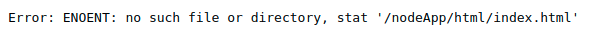

# 1. Docker
[Docker](https://docs.docker.com/) is one of the most popular container runtimes we use at 24G. 
#### Table of Contents
* [Installation](#installation)
* [Dockerfile](#dockerfile)
* [Running a Container](#Running-a-container)
* [Mapping External Devices Into a Container](#Mapping-Host-Devices-Into-a-Container)
* [Persistent Storage](#persistent-storage)
* [Container Management](#Container-Management)

## Installation
* [Install Docker for Ubuntu](https://docs.docker.com/install/linux/docker-ce/ubuntu/)
* [Install Docker for CentOS](https://docs.docker.com/install/linux/docker-ce/centos/)
* [Install Docker for Windows](https://docs.docker.com/docker-for-windows/install/)

---
## Dockerfile and Images
*For this section use `1_FirstContainer`*

Docker builds images by reading the instructions from a `Dockerfile`. A `Dockerfile` is a text document that contains all the commands a user could call on the command line to assemble an image. Think of a Docker image as *class* in object oriented programming, from which we can instantiate our continers from. 

### Building a Dockerfile
* Dockerfile documentation can be found [here](https://docs.docker.com/engine/reference/builder/).

There are many Dockerfile `keywords` and they can be found in the reference above. For this example, we will cover some of the most common.

```
# Base Image
FROM node:8.14.0-alpine

# Create a new directory in the container's fs
RUN mkdir  /nodeApp

# Copy from current directory to /nodeApp
COPY . /nodeApp

# Move to the new directory
WORKDIR /nodeApp

# Setup an environment variable
ENV PORT=3000

# Run npm start when the container starts
CMD npm start

```
A key concept to is what `Dockerfile keywords` run during the build step and runtime. From the example above, all the instructions *expect* `CMD`/`ENTRYPOINT` run once during the build. The only instructions that is used during runtime is the last instruction `CMD` which tells Docker which executable to run when the container starts.

From within the `1_FirstContainer` direcotry... 
### Build the Image
```
// docker build -t <name of the image>:<optional tag> <Dockerfile location>
$ docker build -t myimage:v1 .
```
We can see al Docker images on our machine with [docker images](https://docs.docker.com/engine/reference/commandline/images/)
```
$ docker images
REPOSITORY                TAG             IMAGE ID            CREATED             SIZE
myimages                  v1              22fd13a039d0        Just Now            399MB
```
---

## Running a container
[docker run](https://docs.docker.com/engine/reference/run/) command is used to create a container. There are *many* flags and options associated with this command but for this example we will cover the basics. Please see [reference](https://docs.docker.com/engine/reference/run/) for guidance.

There are two main ways to run a container. In `Foreground mode` or in `Detached mode`.

[Foreground](https://docs.docker.com/engine/reference/run/#foreground) mode starts a process in a container and attaches  the console to the process's standard input, output, and standard error. We can create a tty for the container and keep STDIN open with the `-it` flags. The big take away is that the `-i` flag keeps the `STDIN` open even after execution of the entry command.

```
docker run -it -p 3000:3000 <image>:<option tag> <optional command>
```

We can start our Node server and attach to it with the following command
```
docker run -it  -p 3000:3000 us.gcr.io/g-1575-internal-projects/myImage:v1
```
This starts the server and we can see the logs as requests come through. It however is important to note that we are attached to the container's main executable process and with kill (-9) the process, the container will stop and we will get kicked out.

```
// Inside container

listening on port 3000
Request from ::1
...

^C

// Container killed
```

We can override the container's `CMD` instruction by start the container with our own executable
```
docker run -it  us.gcr.io/g-1575-internal-projects/myImage:v1 /bin/sh
```
This command will start a new container, but this time will just have a shell as the container's main process. We can now navigate the containe's filesytem and spawn child processes, even our node server.

[Detached](https://docs.docker.com/engine/reference/run/#detached--d) mode starts a container the background and will exit when the root process used to tun the container exits. This is contrast to running a container with the `-i` flag which leave `STDIN` open even after completion of the root process. Because the container will stop if the root process exits in a *detached* container, the root process must be run in the foreground of the container.

```
docker run -d -p 80:80 httpd apachectl -D FOREGROUND 
```

### Exposing Ports on Host Machine
By default, each container has its own IP address and can be accessed from the host machine. If you would like to access a container from outside of the host machine, you need to [expose](https://docs.docker.com/engine/reference/run/#expose-incoming-ports) the port on the host machine that maps to the port on container. 

`-p` is used to provide specific mappings
```
-p hostPort:containerPort
-p hostPort-Range:containerPort-Range
-p 8080:80 // Host port 8080 maps to port 80 on the container
```

`-P` pushlishes all exposed ports of the container to the host. Host ports are choosen at random from a configured range.

```
//Dockerfile
...

EXPOSE 80
```
```
// Docker run
brian@BrianDesktop:~$ docker run -d -P httpd
```
```
// Docker ps
brian@BrianDesktop:~$ docker ps
CONTAINER ID        IMAGE               COMMAND              CREATED             STATUS              PORTS                   NAMES
d8d3bcac214b        httpd               "httpd-foreground"   4 seconds ago       Up 2 seconds        0.0.0.0:32768->80/tcp   cranky_jackson
```

### Naming your containers
By default, Docker file randomly assign you containers a human friendly name. If you wish to name your containers, you can with the [--name](https://docs.docker.com/engine/reference/run/#container-identification) flag of the `docker run` command

```
brian@BrianDesktop:~$ docker run -d -P --name dockerIsCool httpd
```

```
brian@BrianDesktop:~$ docker ps
CONTAINER ID        IMAGE               COMMAND              CREATED             STATUS              PORTS                   NAMES
d6a568e8ea6a        httpd               "httpd-foreground"   3 seconds ago       Up 1 second         0.0.0.0:32769->80/tcp   dockerIsCool
```
---
### Push to a Container Registry
[Container Registries](https://docs.docker.com/registry/) are repositories for storing and distributing your Docker images. They can be private or public and self hosted or through a registry provider. At 24G we primarly use [GCP's Container Registry](https://cloud.google.com/container-registry/).

[docker push](https://docs.docker.com/engine/reference/commandline/push/) is used to push an image to registry.

For this example, we've already created a *public* registry so no credentials are required. Almost all other 24G images are private are [require credentials to access](https://docs.docker.com/engine/reference/commandline/login/).

To create a container registry, navigaate to GCP > Container Registry and *Enable API*. By default, GCP container registries are private so we have to signin.

```
$ gcloud auth configure-docker
```

First we need to re-tag our image we made in the last step in order to *push* our image to our registry. We can use the [docker tag](https://docs.docker.com/engine/reference/commandline/tag/) command to do this. Let's tag our image to be pushed to our public registry. An image name is made up of slash-separated name components, optionally prefixed by a registry hostname.

```
// optionalHostname/component1/component2/:tag
// us.gcr.io/j-1794/activation2/:v1
```

To use our registry we have follow a certain image name pattern. Lets tag our earlier image.
```
// us.gcr.io/projectName/imageName:tag
$ docker tag myimage:v1 gcr.io/<project id>/myimage:v1
```
Finally, push your image to the public registry.
```
docker push myimage:v1 gcr.io/<project id>/myimage:v1
```


### Pull an Image
Once a Docker image is hosted in a registry, we can pull down that image to our workstation or server.

[docker pull](https://docs.docker.com/engine/reference/commandline/pull/) command is used to pull down an image from a registry.
```
docker pull us.gcr.io/<>/myImage:v1
```
---
## Mapping Host Devices Into a Container
*For this section use `2_MappingExternalDevices`*

It is possible with Docker to "mount" or "map" a device on the host machine into a container. Use the [--device](https://docs.docker.com/engine/reference/commandline/run/#add-host-device-to-container---device) flag of the `docker run` command. This would be helpful for number of reasons (IoT, local development, PnP, etc.)

By default, `--device` using the same destination device file as the source.
```
$ docker run --device=/dev/sda --rm -it ubuntu fdisk  /dev/sda
```

Mount to a specific device file in the container 
```
$ docker run --device=/dev/sda:/dev/xvdc --rm -it ubuntu fdisk  /dev/xvdc
```
In this example, we will map a arduino board into a container and run simple application to blink a LED light.

First we need to make our new Docker image from the `Dockerfile` provided. In directory *2_MappingExternalDevices* run the following command to build the image.

```
$ docker build -t johnny:v1 .
```
Next, we need to list available devices on the host and their device file. Run the `listDevices.sh` shell script.

```
$ ./listDevices.sh
/dev/input/event9 - Azurewave_USB2.0_HD_UVC_WebCam_0x0001
/dev/input/mouse0 - Logitech_USB_Receiver
/dev/input/event6 - Logitech_USB_Receiver
```

Finally, start a new container with the image we created and map the <TODO> board into it.

```
$ docker run --device=/dev/sda --rm -id johnny:v1
```
We should now start to see the LED blink.

---
## Persistent Storage
*For this section use `3_PersistentStorage`*

By default all files created inside a container are stored on a writable container layer. They will be lost when the container is deleted from the host machine. There are two types of main storage mechanisms we use at 24G, [volumes](https://docs.docker.com/storage/volumes/), and [bind mounts](https://docs.docker.com/storage/bind-mounts/). 

1. [volumes](https://docs.docker.com/storage/volumes/) are a storage device completely managed by Docker. Docer volumes reside on the host's filesystem at `/var/lib/docker/volumes`. We use the [--mount](https://docs.docker.com/storage/volumes/#choose-the--v-or---mount-flag) flag on `docker run` to configure persistent storage.


`Anonymous volumes` will be created automatically on your behalf if you don't specify a source volume.

```
$ docker run -it --name storagetest --mount type=volume,dst=/tmp/fooBar centos /bin/bash
```
```
$ docker inspect 23d5f5549cf4 --format '{{.Mounts}}'
[{
  volume 798efd6ec745b337af5c093f874345d02589861079224542d9850497e3a1093c 
  /var/lib/docker/volumes/798efd6ec745b337af5c093f874345d02589861079224542d9850497e3a1093c
  /_data /tmp/fooBar 
}]
```
```
$ docker volume ls
local               798efd6ec745b337af5c093f874345d02589861079224542d9850497e3a1093c
```

`Named volumes` can be created ahead of time with the [docker volume create](https://docs.docker.com/engine/reference/commandline/volume_create/) command. You can use the created named volume as the source volume for in the `--mount` flag.

```
$ docker volume create foobar
```
```
$ docker volume ls
local               foobar
```
```
$ docker run -it --name foobar --mount type=volume,src=foobar,dst=/tmp/foobar centos /bin/bash
```
```
$ docker inspect foobar --format '{{.Mounts}}'
[{
  volume foobar /var/lib/docker/volumes/foobar/_data 
  /tmp/foobar 
}]
```

2. [Bind mounts](https://docs.docker.com/storage/bind-mounts/) mount a file or directory on the host machine into the container. Bind mounts rely on the host machine's filesystem having specific directory structure available.


let's mount my /tmp directory on my host machine into the container
```
hostmachine$ ls /tmp
heyThere.txt
```

```
$ docker run -it --name foobar --mount type=bind,src=/tmp,dst=/tmp centos /bin/bash
[root@4ac5f31690b2 /] ls /tmp
heyThere.txt
```

```
$ docker inspect foobar --format '{{.Mounts}}'
[{
  bind  /tmp /tmp   true rprivate} 
}]
```

In this example, we'll run a Nodejs application that pulls down content from Imgur and serves images, videos, and gifs locally. We'll attach persistent storage so all of the images pulled will not be lost when the container stops or is deleted.

First, we need to build a new image using the provided `Dockerfile`.
```
$ docker build -t imgurpuller:v1 . 
```

Out of the box, we could start this image and Docker will automatically creat an Anonymous volumes and mount it because of the Docker file directive [Volume](https://docs.docker.com/engine/reference/builder/#volume). 
```
//Dockerfile
...

VOLUME /imgurApp/images
```
Using the `--mount` flag while executing `docker run` (volume or bind mount) will overide this directive.

Let's try running the application with bind mount to a directory on our host machine.
```
$ docker run -d -p 3000:3000 --mount type=bind,src=/tmp/images,dst=/imgurApp/images imgurpuller:v1
```
---

## Container Management
*For this section use `1_FirstContainer`*

[docker ps](https://docs.docker.com/engine/reference/commandline/ps/#options) list all containers running. You can list all containers (running or not) with the `-a[--all]` flag.
```
$ docker ps
CONTAINER ID        IMAGE               COMMAND              CREATED             STATUS              PORTS                   NAMES
d6a568e8ea6a        httpd               "httpd-foreground"   22 hours ago        Up 22 hours         0.0.0.0:32769->80/tcp   dockerIsCool
```
```
$docker ps -a
CONTAINER ID        IMAGE     COMMAND                  CREATED             STATUS                      PORTS                      NAMES
d6a568e8ea6a        httpd     "httpd-foreground"       22 hours ago        Up 22 hours                 0.0.0.0:32769->80/tcp      dockerIsCool
e8c9e0736709        centos    "/bin/tail"              4 days ago          Exited (0) 4 days ago                                  objective_hypatia
208b1b767e6a        centos    "/bin/bash"              4 days ago          Exited (0) 4 days ago                                  relaxed_mcclintock
```

[docker logs](https://docs.docker.com/engine/reference/commandline/logs/) shows the `STDOUT` of a container.
```
$ docker logs d6a568e8ea6a
AH00558: httpd: Could not reliably determine the server's fully qualified domain name, using 172.17.0.2. Set the 'ServerName' directive globally to suppress this message
AH00558: httpd: Could not reliably determine the server's fully qualified domain name, using 172.17.0.2. Set the 'ServerName' directive globally to suppress this message
[Sun Dec 16 03:04:31.727436 2018] [mpm_event:notice] [pid 1:tid 140450030589120] AH00489: Apache/2.4.37 (Unix) configured -- resuming normal operations
[Sun Dec 16 03:04:31.727511 2018] [core:notice] [pid 1:tid 140450030589120] AH00094: Command line: 'httpd -D FOREGROUND'
```

[docker attach](https://docs.docker.com/engine/reference/commandline/attach/) attaches your local `STDIN` and `STDOUT` to a running container.
```
$ docker attach <container ID or name>
```

[docker stop](https://docs.docker.com/engine/reference/commandline/stop/) stops one or more running .containers.
```
$ docker stop <container id or name>
```

[docker rm](https://docs.docker.com/engine/reference/commandline/rm/) removes one or more containers. It's usually a good idea to include the `-v` flag which removes any volumes associated with the container.
```
$ docker rm -v <container id or name>
```

[docker exec](https://docs.docker.com/engine/reference/commandline/exec/) runs a command in a running container. This is extremely useful for getting a shell in in a running container
```
$ docker exec -it <container id or name> /bin/bash
// Inside container
[root]# tail /etc/hosts
```

[docker images](https://docs.docker.com/engine/reference/commandline/images/) lists images
```
$ docker images
REPOSITORY                                      TAG                 IMAGE ID            CREATED             SIZE
us.gcr.io/g-1575-internal-projects/node         10_centos           7bd8bff0f108        12 days ago         517MB
httpd                                           latest              2a51bb06dc8b        4 weeks ago         132MB
```
[docker rmi](https://docs.docker.com/engine/reference/commandline/rmi/) removes one or more images.
```
$ docker rmi <images id or name>
```

Let's try replicate an error with our image. First we need build our "faulty" image. 
```
$ npm install
$ docker build -t broken-image:v1 .
```

Try running that image.
```
$ docker run -d -p 3000:3000 broken-image:v1
426762011d86f3eb286dc0df4890c9a71433f6df3e3639639bb6480c16ff6106

$ docker ps
CONTAINER ID        IMAGE               COMMAND             CREATED             STATUS              PORTS               NAMES
```

The container started without any errors but `docker ps` doesn't show any running containers. This means our container's main process failed causing the container to stop.

We can use the `docker ps -a` command to get the the Container ID of a stopped container
```
$ docker ps -a
CONTAINER ID     IMAGE             COMMAND                  CREATED         STATUS                       PORTS      NAMES
426762011d86     broken-image:v1   "/bin/sh -c 'npm sta…"   3 minutes ago   Exited (254) 3 minutes ago              keen_northcutt
```

Then get the logs from the stopped container.
```
$ docker logs 426762011d86
Error: Cannot find module './middleware/mainRoute.js'
    at Function.Module._resolveFilename (internal/modules/cjs/loader.js:581:15)
    at Function.Module._load (internal/modules/cjs/loader.js:507:25)
    at Module.require (internal/modules/cjs/loader.js:637:17)
    at require (internal/modules/cjs/helpers.js:22:18)
    at Object.<anonymous> (/nodeApp/index.js:3:15)
    at Module._compile (internal/modules/cjs/loader.js:689:30)
    at Object.Module._extensions..js (internal/modules/cjs/loader.js:700:10)
    at Module.load (internal/modules/cjs/loader.js:599:32)
    at tryModuleLoad (internal/modules/cjs/loader.js:538:12)
    at Function.Module._load (internal/modules/cjs/loader.js:530:3)
npm ERR! code ELIFECYCLE
npm ERR! errno 1
npm ERR! 4_containermanagement@1.0.0 start: `node index.js`
npm ERR! Exit status 1
npm ERR!
npm ERR! Failed at the 4_containermanagement@1.0.0 start script.
npm ERR! This is probably not a problem with npm. There is likely additional logging output above.

npm ERR! A complete log of this run can be found in:
npm ERR!     /root/.npm/_logs/2019-01-11T02_59_12_945Z-debug.log
```

Looks like I mistyped my route to a middleware function. lets fix the error and try again.
```
// Line three of index.js
const route = require('./middleware/mainRoute.js');
// Change to 
const route = require('./middle_ware/mainRoute.js');
```

Rebuild the image and run
```
$ docker build docker build -t broken-image:v2 .
$ docker run -d -p 3000:3000 broken-image:v2
f328ba89a889d897bc950dcc3fcd76d9ec853045a46c1598f9e501cd41c40cad

$docker ps
CONTAINER ID    IMAGE               COMMAND                  CREATED         STATUS         PORTS                    NAMES
f328ba89a889    broken-image:v2     "/bin/sh -c 'npm sta…"   2 seconds ago   Up 2 seconds   0.0.0.0:3000->3000/tcp   jolly_clarke
```

For some reason, the page isn't full screen. Let's get into the container and checkout the html. We can start a shell as a new process in the container with the [docker exec](https://docs.docker.com/engine/reference/commandline/exec/).

```
$ docker exec -it f328ba89a889 /bin/sh
# vi html/index.html

// change
<asdfasdf>
  <div id="slice_1" class="slice">^M

// to 
<body>
  <div id="slice_1" class="slice">^M
```


